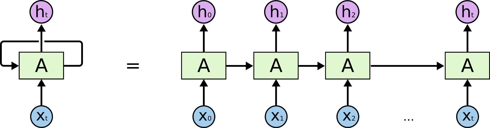

# Recurent-Neural-Network-From-Scratch

In this repository you can find RNN written in numpy from scratch, but without biases, with some theory explanation and methamatical background connected to this subject and some intuition related to. It's one of the type of neural networks that makes use of sequential information. According to some data and its order we are creating expected output.

This repository is done in collaboration with [@FeederDiver](https://github.com/FeederDiver) 

The main file is Recurrent_Neural_Net.ipynb

## You need following packages to run this repository:
1. numpy
2. matplotlib
3. tqdm
